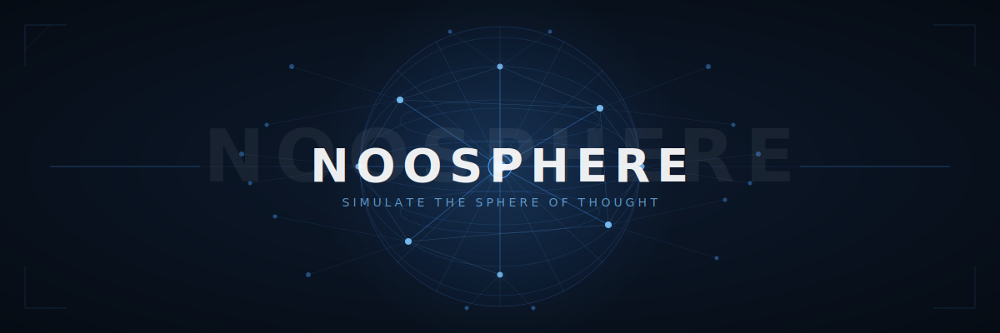

<div align="center">



</div>

<div align="center">

[English](../README.md) · [한국어](./README.ko.md) · **[日本語](./README.ja.md)** · [中文（简体）](./README.zh-CN.md) · [中文（繁體）](./README.zh-TW.md) · [Español](./README.es.md) · [Français](./README.fr.md) · [Deutsch](./README.de.md) · [Português](./README.pt.md)

</div>

---

> **AI駆動のプロダクト検証シミュレーター** — ローンチ前に、実際のコミュニティがあなたのアイデアにどう反応するかをシミュレートします。

NoosphereはHacker News、Product Hunt、Reddit、LinkedIn、IndieHackersなどのプラットフォームで多様なペルソナを生成し、LLMによる複数ラウンドのディスカッションを通じて批判・感情・改善提案を抽出します。

---

## 目次

- [概要](#概要)
- [主な機能](#主な機能)
- [技術スタック](#技術スタック)
- [前提条件](#前提条件)
- [環境変数](#環境変数)
- [インストール](#インストール)
- [実行方法](#実行方法)
- [APIリファレンス](#apiリファレンス)

---

## 概要

プロダクトを説明すると、Noosphereが数百のAIペルソナ（開発者、投資家、懐疑論者、アーリーアダプターなど）を複数のソーシャルプラットフォームで生成し、リアルなディスカッションを行います。シミュレーション結果は以下を含む構造化レポートとして提供されます：

- プラットフォームごとのセンチメント分析
- 繰り返しテーマを集めた批判クラスター
- コミュニティフィードバックに基づく改善提案
- Typstで生成したPDFエクスポート

---

## 主な機能

- マルチプラットフォームシミュレーション: Hacker News, Product Hunt, Reddit Startups, LinkedIn, IndieHackers
- マルチLLMサポート: Anthropic Claude, OpenAI GPT, Google Gemini
- Server-Sent Events (SSE) によるリアルタイムストリーミング
- チェックポイントによる再開可能なシミュレーション
- 入力テキストからの知識グラフ / オントロジー抽出
- PDFレポートエクスポート
- 全シミュレーション履歴
- Dockerベースのデプロイ

---

## 技術スタック

**バックエンド**
- Python 3.11+, FastAPI, uvicorn
- Celery + Redis（非同期タスクキュー）
- SQLite（永続化）
- Anthropic, OpenAI, Google Generative AI SDK
- Typst（PDF生成）

**フロントエンド**
- React 18, TypeScript, Vite
- React Router DOM, react-force-graph-2d, react-markdown

**インフラ**
- Docker + Docker Compose
- Redis 7

---

## 前提条件

- Docker & Docker Compose（推奨）、**または** Python 3.11+ と Node.js 20+
- Redis（Dockerを使わずローカル実行する場合）
- LLM APIキー 最低1つ: Anthropic, OpenAI, または Google Gemini

---

## 環境変数

テンプレートをコピーしてキーを入力します：

```bash
cp .env.example .env
```

### LLM APIキー（最低1つ必須）

**`ANTHROPIC_API_KEY`**
AnthropicのClaude APIキーです。
- サインアップ: https://console.anthropic.com
- **API Keys** → **Create Key** で発行
- ペルソナ生成とディスカッションラウンドの主要LLMプロバイダーとして使用されます。

**`OPENAI_API_KEY`**
OpenAI APIキーです。
- サインアップ: https://platform.openai.com
- **API keys** → **Create new secret key** で発行
- フォールバックLLMプロバイダーとして使用されます。

**`GEMINI_API_KEY`**
Google Gemini APIキーです。
- キーの取得: https://aistudio.google.com/app/apikey
- フォールバックLLMプロバイダーとして使用されます。

---

### データソースAPIキー（任意 — シミュレーションのコンテキストを強化）

**`SERPER_API_KEY`**
Serper.devを通じたGoogle Search APIです。実世界のコンテキスト取得のためのWeb検索を有効にします。
- サインアップ: https://serper.dev
- 無料ティア: 月2,500クエリ
- **Dashboard** でAPIキーを確認・コピー

**`PRODUCT_HUNT_API_KEY`**
トレンドプロダクトやコミュニティデータ取得のためのProduct Hunt APIです。
- 申請: https://api.producthunt.com/v2/docs
- **Developer Settings** → アプリ作成 → APIトークンをコピー

**`SEMANTIC_SCHOLAR_API_KEY`**
研究論文コンテキストのためのSemantic Scholar Academic APIです。
- アクセス申請: https://www.semanticscholar.org/product/api
- 無料ティアあり。キーなしでも動作しますが、キーがあるとレートリミットが緩和されます。

**`GITHUB_TOKEN`**
リポジトリデータ取得のためのGitHub Personal Access Tokenです。
- 発行: https://github.com/settings/tokens
- **Generate new token (classic)** → `public_repo` スコープを選択して生成

---

### インフラ

**`REDIS_URL`**
Redis接続URL（Celeryブローカー）。
デフォルト: `redis://localhost:6379/0`
Docker Compose使用時: `redis://redis:6379/0`

**`DB_PATH`**
SQLiteデータベースファイルのパス。
デフォルト: `noosphere.db`

**`SOURCES_DB_PATH`**
ソース/キャッシュSQLiteデータベースのパス。
デフォルト: `noosphere_sources.db`

---

### ジョブ設定

**`MAX_JOBS`** — 同時実行可能なシミュレーション最大数。デフォルト: `5`
**`SIM_QUEUE_TIMEOUT_SECONDS`** — キュー待機中のシミュレーションのタイムアウト。デフォルト: `900`（15分）
**`SIM_HEARTBEAT_TIMEOUT_SECONDS`** — 停止したシミュレーション検出の間隔。デフォルト: `90`

---

### レートリミット

LLMプロバイダーのクォータを超えないように調整します。

**`OPENAI_RPM`** — OpenAI 1分あたりリクエスト数。デフォルト: `500`
**`OPENAI_RPM_SAFETY`** — 安全マージン係数 (0–1)。デフォルト: `0.80`
**`OPENAI_TPM`** — OpenAI 1分あたりトークン数。デフォルト: `100000`
**`ANTHROPIC_TPM`** — Anthropic 1分あたりトークン数。デフォルト: `40000`
**`GEMINI_TPM`** — Gemini 1分あたりトークン数。デフォルト: `250000`

各プロバイダーのダッシュボードで実際の上限を確認し、適切に設定してください。

---

### フロントエンド

**`VITE_API_URL`** *(`frontend/.env` に設定)*
バックエンドAPIのベースURL。デフォルト: `http://localhost:8000`

---

## インストール

### 方法A: Docker Compose（推奨）

```bash
git clone https://github.com/your-username/noosphere.git
cd noosphere
cp .env.example .env
# .env にAPIキーを入力

docker-compose up --build
```

サービス:
- フロントエンド: http://localhost:5173
- バックエンドAPI: http://localhost:8000
- Redis: localhost:6379

### 方法B: ローカル開発

**バックエンド**

```bash
pip install -e ".[dev]"

redis-server

uvicorn backend.main:app --reload --host 0.0.0.0 --port 8000

# 別ターミナルで
celery -A backend.celery_app worker --loglevel=info --concurrency=2
```

**フロントエンド**

```bash
cd frontend
npm install
npm run dev
# http://localhost:5173 で起動します
```

---

## 実行方法

1. ブラウザで http://localhost:5173 を開く
2. ホームページでプロダクトの説明を入力
3. シミュレーションのラウンド数と対象プラットフォームを選択
4. シミュレーションの進行状況をリアルタイムで確認
5. 構造化レポートを確認し、PDFとしてエクスポート
6. 履歴ページで過去のシミュレーションを参照

---

## APIリファレンス

| メソッド | エンドポイント | 説明 |
|---------|--------------|------|
| POST | `/simulate` | 新しいシミュレーションを開始 |
| GET | `/simulate-stream/{id}` | リアルタイム進行SSEストリーム |
| GET | `/results/{id}` | 完了した結果を取得 |
| GET | `/history` | 全シミュレーション一覧 |
| GET | `/export/{id}` | PDFレポートをダウンロード |
| POST | `/simulate/{id}/cancel` | 実行中のシミュレーションをキャンセル |
| POST | `/simulate/{id}/resume` | 一時停止中のシミュレーションを再開 |
| DELETE | `/simulate/{id}` | シミュレーションを削除 |
| GET | `/simulate/{id}/status` | シミュレーション状態を確認 |
